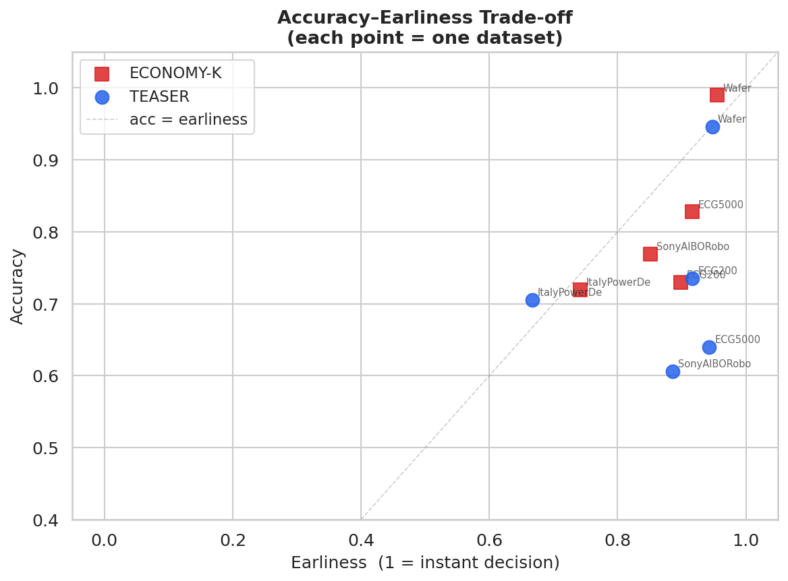
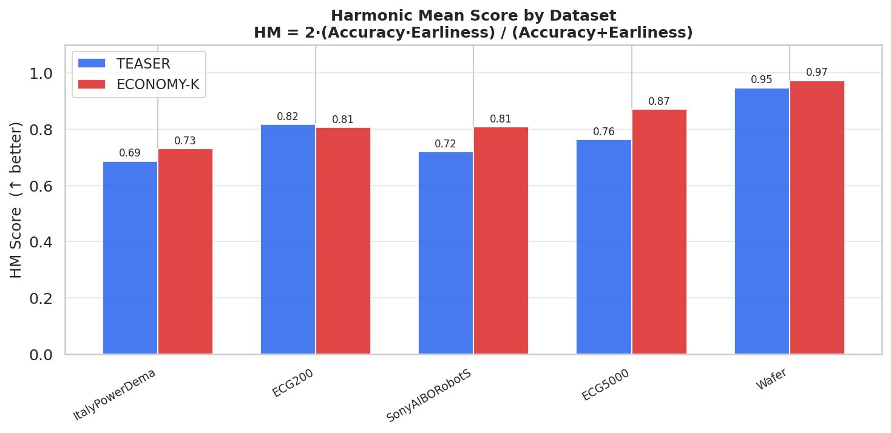
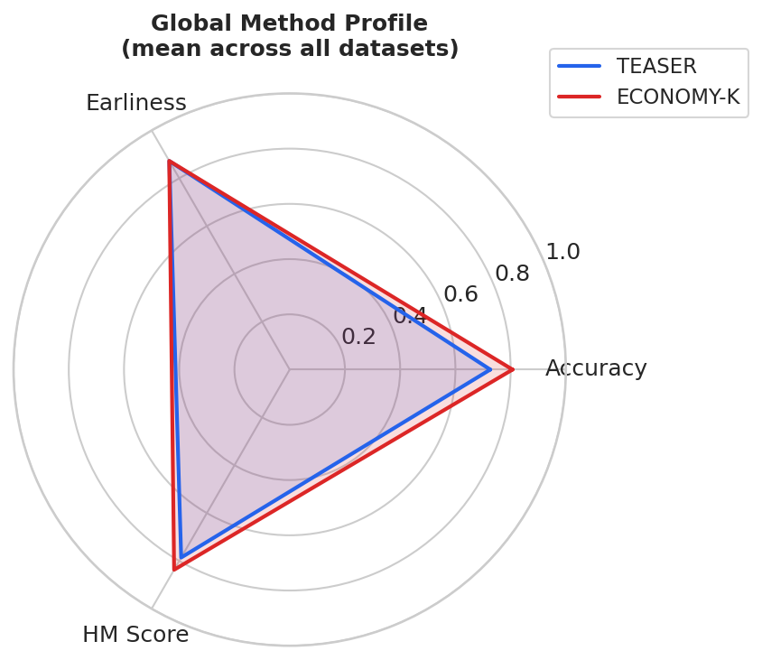
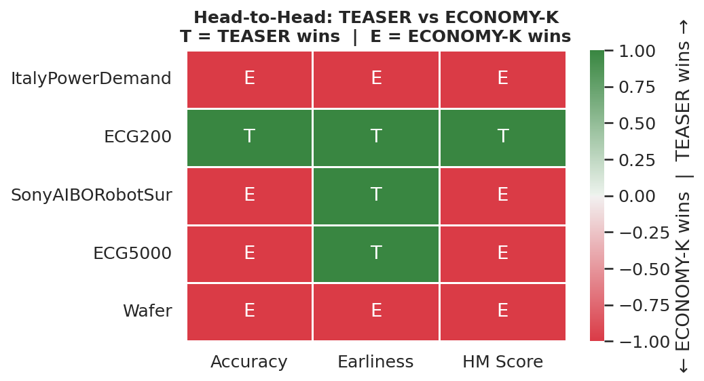
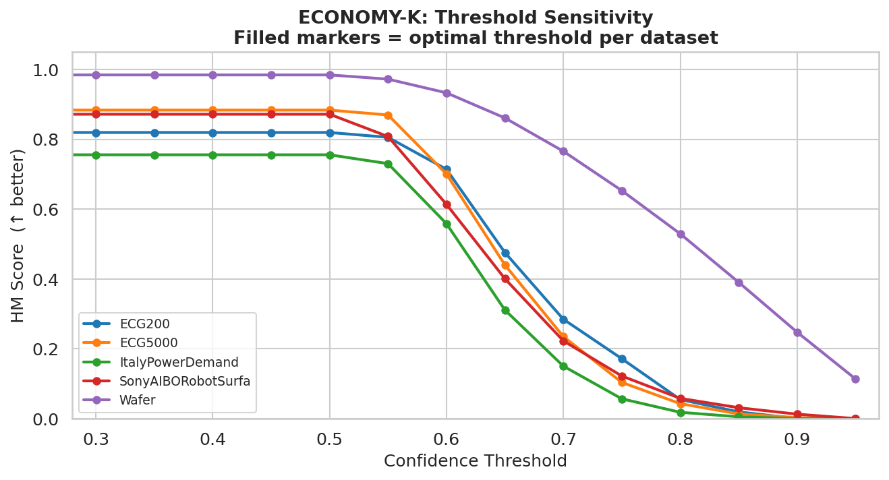
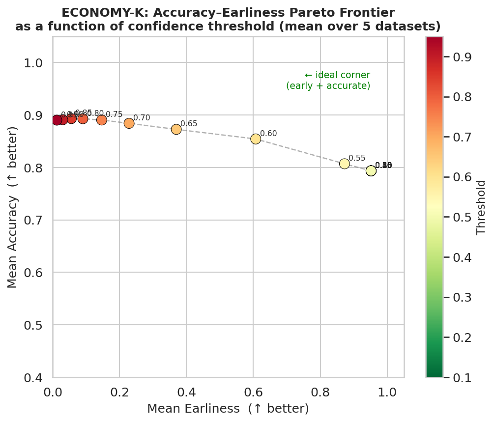

# stream-anomaly-benchmark

> **Benchmarking early time series classification methods under the earliness–reliability–stability trilemma**

[](https://www.python.org/)
[](LICENSE)
[]()

---

## Motivation

Early classification of time series asks a deceptively simple question:
**_At what point in an incoming data stream can we make a reliable decision — and how early is early enough?_**

This question sits at the heart of network anomaly detection, predictive maintenance, and cybersecurity incident triage, where acting too late is costly but acting too early on a noisy signal is equally dangerous.

Existing methods optimize for **earliness** or **accuracy** in isolation. This benchmark explicitly targets the three-way trade-off:

| Dimension | Description |
|---|---|
| **Earliness** | How soon after stream onset is a decision triggered? |
| **Reliability** | How accurate is the decision at trigger time? |
| **Stability** | How consistent are decisions across random seeds and stream perturbations? |

No published benchmark jointly evaluates all three dimensions across methods and datasets. This repository fills that gap.

---

## Preliminary Results

Benchmark on 5 UCR datasets across 3 random seeds (42, 0, 1):

| Method | Accuracy | Earliness | HM Score | Datasets won |
|---|---|---|---|---|
| **ECONOMY-K** | **0.807** | 0.873 | **0.837** | **4 / 5** |
| TEASER | 0.726 | **0.872** | 0.786 | 1 / 5 |

**Key finding:** Both methods achieve similar earliness (~0.87), but ECONOMY-K maintains significantly higher accuracy. No single method dominates across all datasets — confirming the need for adaptive, dataset-aware orchestration strategies.

Full results: [`results/benchmark_results_full.csv`](results/benchmark_results_full.csv)

### Figures

| Pareto Frontier | HM Score by Dataset |
|---|---|
|  |  |

| Global Profile (Radar) | Head-to-Head Heatmap |
|---|---|
|  |  |

---

## Methods

| Method | Reference | Key idea |
|---|---|---|
| **TEASER** | Schäfer & Leser, 2020 | Two-tier classifier with non-myopic stopping rule (WEASEL + OCSVM) |
| **ECONOMY-K** | Achenchabe et al., 2021 | Cost-sensitive stopping — triggers when expected future gain < current cost |

Both methods are benchmarked via a unified evaluation harness with reproducible seeds, consistent train/test splits, and a shared metric suite.

---

## Datasets

All datasets from the [UCR Time Series Archive](https://www.cs.ucr.edu/~eamonn/time_series_data_2018/) (Dau et al., 2018).

| Dataset | Domain | Train | Test | T | Classes |
|---|---|---|---|---|---|
| ItalyPowerDemand | Energy | 67 | 1029 | 24 | 2 |
| ECG200 | ECG | 100 | 100 | 96 | 2 |
| SonyAIBORobotSurface1 | Robotics | 20 | 601 | 70 | 2 |
| ECG5000 | ECG | 500 | 4500 | 140 | 5 |
| Wafer | Industrial | 1000 | 6164 | 152 | 2 |

---

## Metrics

```
Earliness(t)  = 1 - (t / T)                          # fraction of series unseen at decision
HM_score      = 2 · (Accuracy · Earliness) / (Accuracy + Earliness)
Stability(σ)  = mean std of trigger_time across seeds  # lower = more stable
```

---

## Repository Structure

```
stream-anomaly-benchmark/
│
├── src/
│   ├── datasets.py       # UCR loader + preprocessing
│   ├── metrics.py        # Earliness, HM score, stability
│   ├── evaluate.py       # TEASER + ECONOMY-K pipelines
│   └── plot_results.py   # 4 publication-ready figures
│
├── notebooks/
│   └── 01_trilemma_analysis.ipynb   # Full analysis notebook
│
├── results/
│   ├── benchmark_results_full.csv
│   └── figures/
│       ├── fig1_pareto_scatter.png
│       ├── fig2_hm_score_bars.png
│       ├── fig3_radar_profile.png
│       └── fig4_wins_heatmap.png
│
├── requirements.txt
└── README.md
```

---

## Quickstart

```bash
git clone https://github.com/moncefabel/stream-anomaly-benchmark
cd stream-anomaly-benchmark

# Setup
curl -LsSf https://astral.sh/uv/install.sh | sh
uv venv && source .venv/bin/activate
uv pip install -r requirements.txt

# Run benchmark (fast datasets)
python src/evaluate.py

# Generate figures
python src/plot_results.py
```

---

## Roadmap

- [x] Repository structure and README
- [x] UCR dataset loader (`sktime` + `aeon`)
- [x] TEASER evaluation pipeline
- [x] ECONOMY-K evaluation pipeline
- [x] Unified metric suite (earliness, HM score, stability)
- [x] Results on 5 UCR datasets + 4 figures
- [ ] Threshold sensitivity analysis (ECONOMY-K)
- [ ] Analysis notebook
- [ ] Extended benchmark (10+ datasets)
- [ ] Technical report (PDF)

---

## Scientific Context

This project is developed as preparatory work for a CIFRE doctoral thesis at **Orange Innovation / EURECOM** on the optimization of cybersecurity incident diagnostics under time and explainability constraints.

The earliness–reliability–stability trilemma maps directly onto the operational constraints of network anomaly detection:

- A **too-early** trigger fires on transient noise → false positive, wasted remediation effort
- A **too-late** trigger misses the early remediation window → incident escalates
- An **unstable** trigger produces inconsistent decisions across similar incidents → untrusted system

Understanding the Pareto frontier between these three objectives is a prerequisite for designing reliable **multi-model orchestration systems** for NetOps/SecOps — where heterogeneous agents must collectively decide when and how to escalate an anomaly signal.

---

## References

- Schäfer, P., & Leser, U. (2020). [TEASER: Early and Accurate Time Series Classification](https://doi.org/10.1007/s10618-020-00707-1). *Data Mining and Knowledge Discovery*, 34, 1598–1626.
- Achenchabe, Y., Bondu, A., Cornuéjols, A., & Dachraouc, A. (2021). [Early Classification of Time Series: Cost-Based Optimization Criterion and Algorithms](https://doi.org/10.1007/s10994-021-05974-z). *Machine Learning*, 110, 1481–1517.
- Mori, U., Mendiburu, A., Keogh, E., & Lozano, J. A. (2017). Reliable early classification of time series based on discriminating the classes over time. *Data Mining and Knowledge Discovery*, 31(1), 233–263.
- Dau, H. A., et al. (2018). [The UCR Time Series Archive](https://arxiv.org/abs/1810.07758). *IEEE/CAA Journal of Automatica Sinica*.

---

## Author

**Moncef Bouhabel** — ML Engineer, Master ML for Data Science, Université Paris Cité
[github.com/moncefabel](https://github.com/moncefabel)


---

## Sensitivity Analysis

ECONOMY-K threshold sweep (τ ∈ [0.10, 0.95]) across all datasets:

| Figure | |
|---|---|
|  |  |

**Key finding:** HM score plateaus for τ < 0.55 across all datasets — the 1-NN confidence metric saturates at low thresholds. The effective decision zone is τ ∈ [0.55, 0.70], motivating research on richer confidence estimators for adaptive stopping rules.

---

## Heterogeneous Orchestration

Three cooperation schemes combining TEASER + ECONOMY-K:

| Scheme | Rule | Trade-off |
|---|---|---|
| **OR** | Either agent triggers | Max earliness |
| **AND** | Both agents agree | Max reliability |
| **WEIGHTED** | Weighted vote by accuracy | Adaptive balance |

Results: [`results/orchestrator_results.csv`](results/orchestrator_results.csv)

**Research question:** Can heterogeneous agents cooperate to collectively navigate the trilemma better than any single agent? This prototype directly addresses the thesis scientific objective.